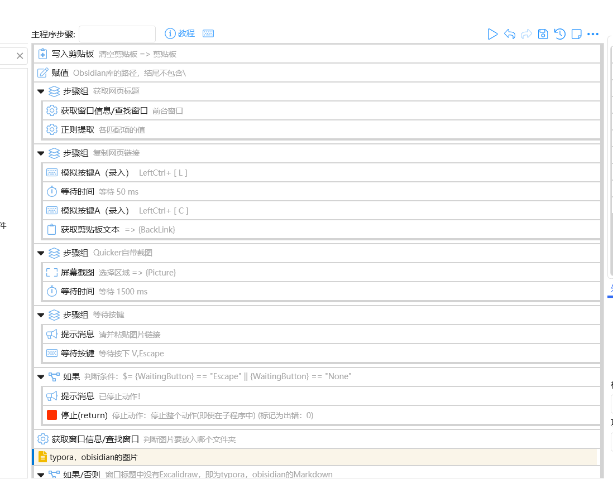
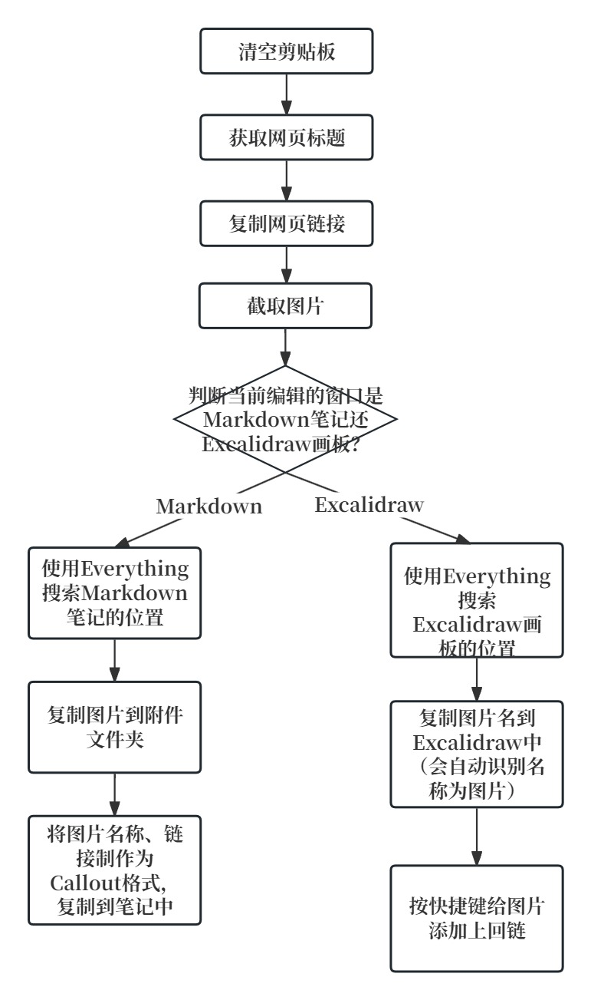

# WebPage-Obsidian

知乎文字链接：[Obsidian与摘录网页图片](https://zhuanlan.zhihu.com/p/698613409)

哔哩哔哩视频链接：[Obsidian与摘录网页图片](https://www.bilibili.com/video/BV1Hz421Y7w9/?spm_id_from=333.1387.homepage.video_card.click&vd_source=c08c205650a4a5e13d87475ab1ab2431)

这次突然想到一个摘录网页的动作，截取网页图片，并复制网页链接。然后将图片复制到Obsidian库中，并复制上摘录链接。

思路非常简单：

首先将获取网页的标题，用正则表达式提取标题为我们想要的；

然后按快捷键复制网页链接；

接着使用Quicker自带的截图功能；

最后到Obsidian中复制。

Quicker动作（一部分）：

思路图：

摘录到Markdown中的演示：

摘录到Excalidraw中的演示：

我将Quicker动作、不同的摘录情况的调试运行详情放到了[github仓库](https://github.com/operations4304/WebPage-Obsidian)

**但没法直接用**，因为每个人的附件管理方式不一样！最好结合本文的思路，修改一下Quicker动作中的一些步骤。

如果你对图片的复制方式不清楚，可以查看这篇文章，[附件管理方式](https://zhuanlan.zhihu.com/p/690376509)，介绍了附加的储存情况。

